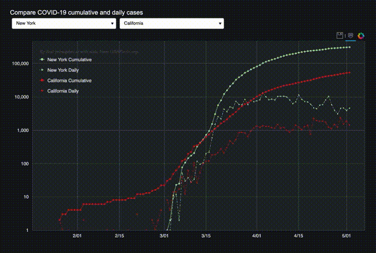

# Importing and Visualizing COVID-19 Cases
| |
------------------------|-----

## Quick Intro

Check out these Jupyter notebooks to get started:
https://nbviewer.jupyter.org/github/jjbenes/covid19/tree/master/jupyter/
You'll learn how to import data from USAFacts and Johns Hopkins, review data tables, plot a few graphs,
and visualize data spatially using a U.S. county map.

## Live State- and County-Level Updates
* The choropleths at https://first-principles.ai/covid-19/map.html are updated using the code here and COVID-19 data from the USAFacts. The choropleths display U.S. state and county confirmed cases.
* You can compare cumulative and daily cases between any two states
  (including Washington D.C.) using the interactive chart at
  https://first-principles.ai:5100/compare_states.

## Python Library
### Data Import

This Python library currently supports COVID-19 CSV import from Johns Hopkins University and USAFacts
in https://github.com/jjbenes/covid19/tree/master/python/fp_covid19/data.
The Johns Hopkins CSSE class and the USAFacts class are subclasses of `Bears`.
(Pandas are more like bears than racoons.)
You can add your own `Bears` subclasses for different COVID-19 data sources, such as
the New York Times: https://github.com/nytimes/covid-19-data.
We recommend using the column labels from Johns Hopkins as the de facto standard,
so you can use the routines in the Jupyter notebook and the compute modules (see below).

### Compute Module

A couple simple examples that manipulate the raw data are in
https://github.com/jjbenes/covid19/tree/master/python/fp_covid19/cases.
One routine computes the number of new cases and another generates per-capita data.
You can, for instance, contribute curve-fitting routines here.

### Visualization Module
A visualization module in https://github.com/jjbenes/covid19/tree/master/python/fp_covid19/visualization
contains Folium and GeoJSON helper routines to present the data visually using maps.

## Data Sources
* Johns Hopkins CSSE COVID-19 Data Repository https://github.com/CSSEGISandData/COVID-19
* USAFacts
  * Confirmed cases: https://usafactsstatic.blob.core.windows.net/public/data/covid-19/covid_confirmed_usafacts.csv
  * Deaths: https://usafactsstatic.blob.core.windows.net/public/data/covid-19/covid_deaths_usafacts.csv
  * County population: https://usafactsstatic.blob.core.windows.net/public/data/covid-19/covid_county_population_usafacts.csv
* Folium GeoJSON files for U.S. states in the folder "json":
  https://github.com/python-visualization/folium/blob/master/tests/us-states.json
* U.S. county borders created from USGS data as of 3/11/2020 (which will some day replace the state border json)
* This Jupyter notebook creates a time-slider choropleth using data from USAFacts:
https://nbviewer.jupyter.org/github/jjbenes/covid19/blob/master/jupyter/covid19_usafacts.ipynb.
* This one creates it using data from JHU:
https://nbviewer.jupyter.org/github/jjbenes/covid19/blob/master/jupyter/covid19_jhu_csse.ipynb. The difference is just one import statement.
